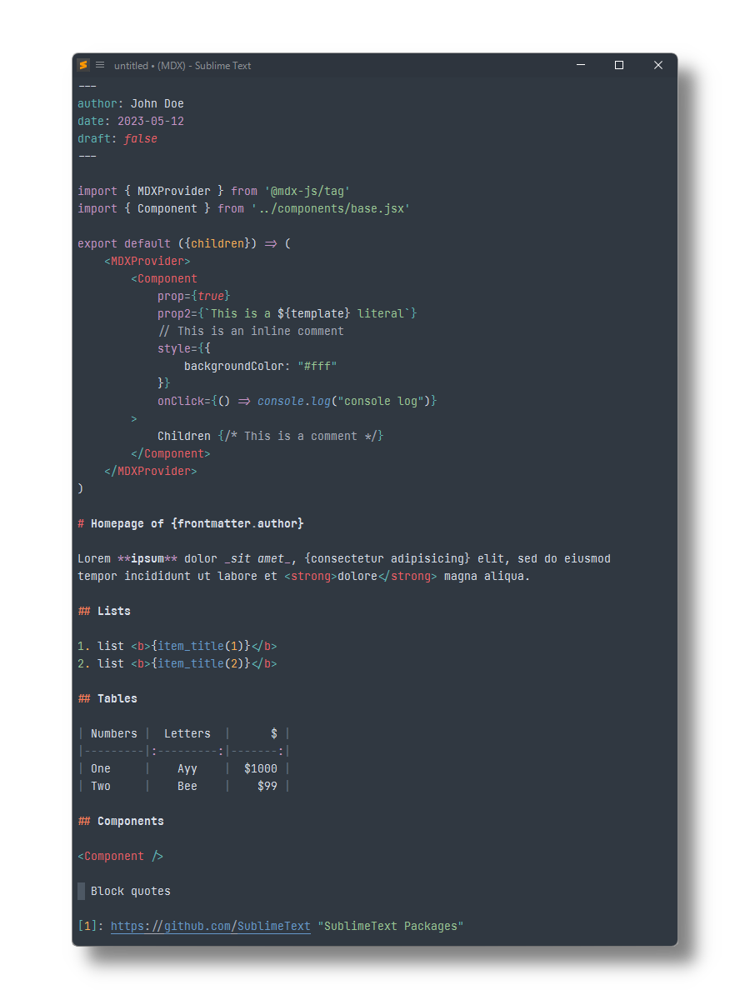

MDX
===

[MDX](https://github.com/mdx-js/mdx) syntax definitions for [Sublime Text](https://www.sublimetext.com) based on its HTML, Markdown and JSX syntaxes.

## Installation

### Package Control

The easiest way to install is using [Package Control](https://packagecontrol.io). It's listed as `MDX`.

1. Open `Command Palette` using <kbd>ctrl+shift+P</kbd> or menu item `Tools → Command Palette...`
2. Choose `Package Control: Install Package`
3. Find `MDX` and hit <kbd>Enter</kbd>

### Manual Install

1. Download appropriate [MDX.sublime-package](https://github.com/SublimeText/MDX/releases) for your Sublime Text build.  
   _A suffix (e.g. `-st4xxx`) denotes the least required ST build for the sublime-package to work._
2. Rename it to _MDX.sublime-package_
3. Copy it into _Installed Packages_ directory

> [!NOTE]
>
> To find _Installed Packages_...
>
> 1. call _Menu > Preferences > Browse Packages.._
> 2. Navigate to parent folder

> [!WARNING]
>
> Manually installed packages are not automatically updated by Package Control.

## Usage

1. Open an `.mdx` file
2. Select `View > Syntax > MDX`
